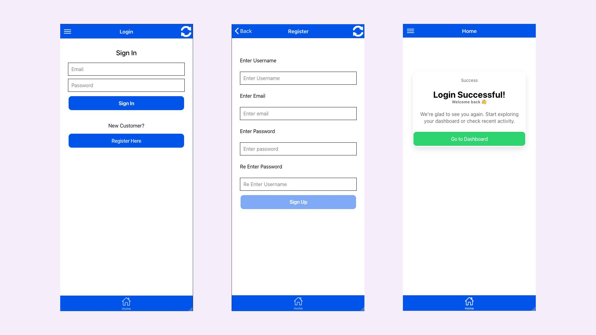

# 🔐 WordPress WooCommerce Login & Register with Ionic and Angular

An open-source mobile authentication starter that lets your users **log in and register as customers** to a **WooCommerce WordPress site** using **Ionic Framework and Angular**. Ideal for developers building mobile apps powered by WooCommerce REST API.


---

## 🌟 Features

- ✅ WordPress login with JWT (JSON Web Tokens)
- ✅ WooCommerce with REST API V3
- ✅ Register as a Customer using WooCommerce REST API
- ✅ Ionic Angular UI with responsive login form
- ✅ Secure login via WordPress REST API
- ✅ Easy setup and customization
- ✅ Works with WordPress plugins like JWT Auth or WP OAuth
- ✅ Mobile-ready — built with Ionic

---

## 🚀 Use Cases

This project is perfect for:

- Developers building Ionic mobile apps connected to WordPress
- Hybrid apps needing WordPress user authentication
- Developers building **eCommerce mobile apps** with WooCommerce backend
- Hybrid apps needing **WooCommerce user registration + login**
- Open-source contributors looking for an Ionic starter with WordPress WooCommerce backend
- Teams building **headless WooCommerce** apps

---

## 🛠️ Technologies Used

- [WordPress](https://wordpress.org/)
- [Ionic Framework](https://ionicframework.com/)
- [Angular](https://angular.io/)
- [WooCommerce](https://wordpress.org/plugins/woocommerce/)
- [JWT Auth for WP REST API](https://wordpress.org/plugins/jwt-authentication-for-wp-rest-api/)

---

## 📦 Installation & Setup

1. Clone this repository:
   ```bash
   git@github.com:hasancse06/woocommerce-login-register-ionic-angular.git
   cd woocommerce-login-register-ionic-angular


## Screenshot


   
## 🙌 Author

**M A Hasan**
- 🔭 Full-Stack Web Developer | Ionic Framework, Angular, Node.js & REST APIs
- 🌐 About Me [https://hasan.online](https://hasan.online)
- 🎓 Instructor on [Udemy](https://www.udemy.com/user/m-a-hasan-2/)
- 🧠 Creator at [Envato](https://themeforest.net/user/hasanonline)
- ✍️ Blogger at [blog.hasan.online](https://blog.hasan.online)


## ⭐ Support This Project

If you find this useful:
- ⭐ Star the repository on GitHub
- 🔗 Share it with fellow Ionic, WordPress, or mobile app developers
- 💡 Contribute with feedback or pull requests

> Together, we make WordPress more mobile-friendly and developer-first 🚀
